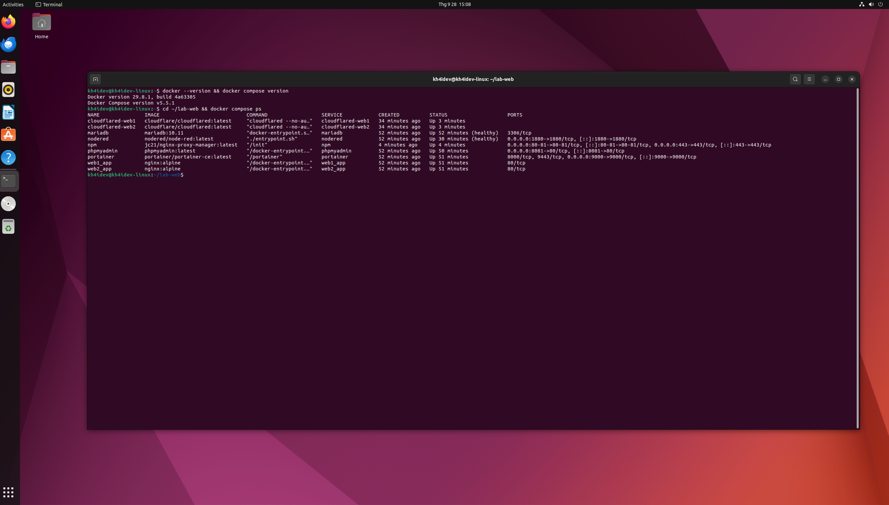
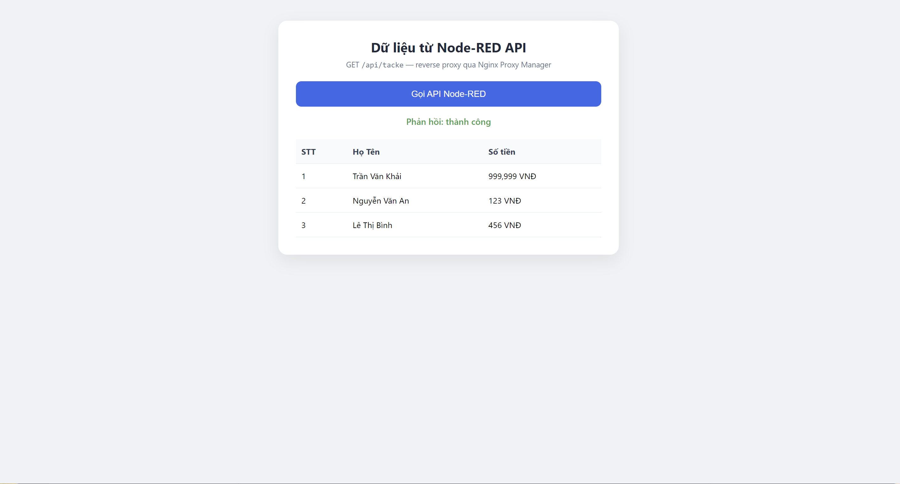

# BÁO CÁO BÀI TẬP VỀ NHÀ — LẬP TRÌNH WEB

| Thông tin | Nội dung |
|---|---|
| **Môn học** | Lập trình Web |
| **Lớp** | 59KMT |
| **Giảng viên hướng dẫn** | Đỗ Duy Cốp |
| **Sinh viên thực hiện** | Trần Văn Khải |
| **MSSV** | K235480106035 |
| **Deadline** | 23h59 ngày 28/9/2026 |
| **Hình thức** | Push lên GitHub (public) |

---

## 1. Mục tiêu
Giả lập hệ điều hành Linux, dựng hệ thống nhiều dịch vụ bằng **Docker Compose**, cấu hình
**nginx chạy 2 website với 2 domain**, và tạo **API bằng Node-RED** rồi gọi từ JavaScript.

## 2. Yêu cầu đề bài

**Bài 1**
1. Giả lập Linux OS: Hyper-V / VirtualBox / VMware / WSL.
2. Cài đặt Docker Compose trên OS đó.
3. Cài bằng Docker Compose các dịch vụ: **nginx, nodered, mariadb, phpmyadmin, cloudflared**.
4. Cấu hình nginx chạy **2 website với 2 domain khác nhau**.

**Bài 2**
1. Dùng Node-RED: `http in` + `http response` → tạo API đơn giản.
2. Cấu hình nginx để web dùng JS gọi được API (không lỗi CORS).
3. Code JS trong HTML gọi API.

## 3. Công nghệ sử dụng

| Thành phần | Công nghệ |
|---|---|
| OS giả lập | Ubuntu 22.04.5 LTS trên VMware Workstation |
| Container | Docker 29.8.1 + Docker Compose v5.5.1 |
| nginx (reverse proxy) | Nginx Proxy Manager `jc21/nginx-proxy-manager` |
| Website | nginx:alpine phục vụ HTML tĩnh |
| API | Node-RED (`nodered/node-red`) |
| CSDL | MariaDB 10.11 |
| Quản trị CSDL | phpMyAdmin |
| Public ra Internet | Cloudflare Tunnel (`cloudflare/cloudflared`) |
| Quản lý container | Portainer |

## 4. Kiến trúc hệ thống

```text
Client (Internet)
   │  HTTPS
   ▼
Cloudflare Edge  (web1.kh4idev.id.vn / web2.kh4idev.id.vn)
   │  Cloudflare Tunnel
   ▼
Container cloudflared ──► http://npm:80
   ▼
Container npm (Nginx Proxy Manager)  ← điều phối theo Host
   ├── web1.kh4idev.id.vn ──► web1_app:80   (Website 1)
   └── web2.kh4idev.id.vn ──► web2_app:80   (Website 2)
                                   └── /api ──► nodered:1880
```

## 5. Cấu trúc thư mục

```text
BAITAP_LTW/
├── README.md
├── bt01_docker-compose/          # Bài 1
│   ├── docker-compose.yml
│   ├── .env.example
│   ├── web1_html/index.html
│   ├── web2_html/index.html
│   └── nodered/flows.json
├── bt02_nodered-api/README.md    # Bài 2
├── docs/                         # hướng dẫn chụp ảnh / cài đặt
├── evidence/                     # log lệnh chứng minh (text)
└── images/                       # ảnh minh chứng
```

## 6. Cách chạy

```bash
cd bt01_docker-compose
cp .env.example .env          # điền token Cloudflare + mật khẩu DB
docker compose up -d
```

| Dịch vụ | Địa chỉ |
|---|---|
| Nginx Proxy Manager | http://<IP>:81 |
| Node-RED | http://<IP>:1880 |
| phpMyAdmin | http://<IP>:8081 |
| Portainer | http://<IP>:9000 |
| Website | https://web1.kh4idev.id.vn · https://web2.kh4idev.id.vn |

## 7. Kết quả

- 2 website chạy trên 2 domain riêng, công bố ra Internet qua Cloudflare Tunnel (HTTPS).
- API Node-RED `/api/tacke` trả JSON; trang web gọi được API không lỗi CORS.
- Dựng toàn bộ hệ thống bằng một lệnh `docker compose up -d`.





> Đầy đủ ảnh: xem thư mục [`images/`](images/). Log lệnh: [`evidence/BAI1-2-BANGCHUNG.md`](evidence/BAI1-2-BANGCHUNG.md).

## 8. Tiến độ

- [x] Giả lập Linux OS (Ubuntu trên VMware)
- [x] Cài Docker & Docker Compose
- [x] Dựng nginx, nodered, mariadb, phpmyadmin, cloudflared, portainer
- [x] nginx chạy 2 website 2 domain (NPM)
- [x] API Node-RED (http in + http response)
- [x] JS gọi API qua reverse proxy (không CORS)
- [x] Cloudflare Tunnel + HTTPS cho 2 domain
- [x] Ảnh minh chứng + README

## 9. Nhận xét & kết luận
Mô hình "tunnel → nginx (NPM) → container theo Host" giúp chỉ cần **1 cổng vào** mà vẫn
phục vụ nhiều domain; việc tách `/api` sang Node-RED ngay trong nginx giúp tránh CORS hoàn toàn.

---
*Báo cáo được trình bày bởi Trần Văn Khải — MSSV: K235480106035.*
